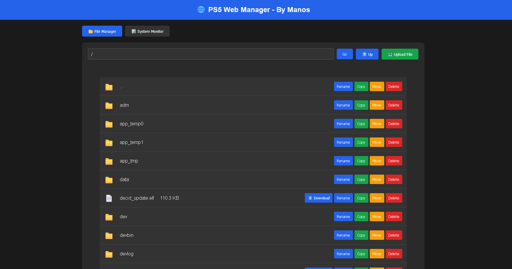
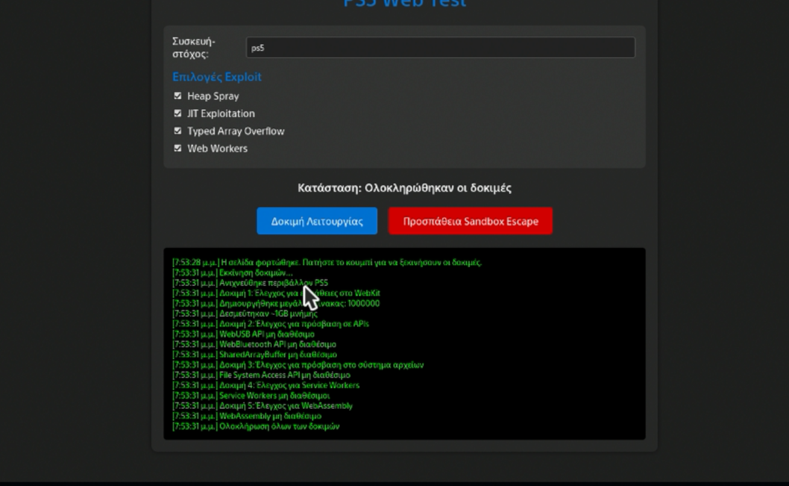

# 🌐 PS5 Web-Based File Manager + System Monitor

**By Manos**

A powerful web-based file manager and system monitor for PS5 with etaHEN.

## ✨ Features

### 📁 File Manager
- **Browse filesystem** - Navigate all PS5 directories
- **📤 Upload files** - Upload files from your computer to PS5
- **⬇️ Download files** - Download any file with one click
- **Rename files** - Rename files and folders
- **Copy/Move files** - Copy or move files between directories
- **Delete files/folders** - Remove files and directories
- **Real-time updates** - See changes instantly
- **Modern UI** - Clean, responsive design with progress bars
- **Cross-platform** - Access from any device with a browser

### 📊 System Monitor
- **Storage info** - /data and /system storage usage
- **RAM usage** - Memory usage and available RAM
- **System uptime** - How long the PS5 has been running
- **Network info** - IP address and hostname
- **Server stats** - Total requests, files transferred, data transferred
- **Real-time updates** - Auto-refresh every second

## 🚀 How to Use

### 1. Compile
```bash
# On Windows with WSL
wsl -d Ubuntu-22.04 bash "/mnt/c/Users/HACKMAN/Desktop/ps5 test/ps5_rom_keys/ps5_web_manager/compile.sh"
```

### 2. Upload to PS5
- Copy `ps5_web_manager.elf` to `/data/etaHEN/payloads/`
- Use FTP or USB

### 3. Run on PS5
- Load the payload with elfldr
- You'll see a notification: `Web Manager: http://192.168.0.160:8080 - By Manos`

### 4. Access Web Interface
- Open browser on any device (PC, phone, tablet)
- Go to: `http://YOUR_PS5_IP:8080`
- Enjoy!

## 📱 Supported Devices

Access from:
- ✅ Windows PC
- ✅ Mac
- ✅ Linux
- ✅ Android phone/tablet
- ✅ iPhone/iPad
- ✅ Any device with a web browser!

## 🎯 Usage Examples

### File Manager
1. **Browse directories** - Click on folders to navigate
2. **Upload files** - Click "📤 Upload File" button, select file, watch progress bar
3. **Download files** - Click "⬇️ Download" button or click on file name
4. **Rename** - Click "Rename" button, enter new name
5. **Copy/Move** - Click "Copy" or "Move", select destination folder
6. **Delete items** - Click "Delete" button
7. **Go up** - Click "⬆️ Up" button
8. **Manual navigation** - Type path and click "Go"

### System Monitor
- View storage usage
- Check free space
- Monitor system uptime
- Auto-refreshes every 5 seconds

## 🔧 Technical Details

### Backend
- **Language**: C
- **HTTP Server**: Custom implementation
- **Port**: 8080
- **Multi-threaded**: Yes
- **REST API**: JSON responses

### Frontend
- **Pure HTML/CSS/JavaScript** - No dependencies
- **Responsive design** - Works on all screen sizes
- **Dark theme** - Easy on the eyes
- **AJAX** - Async operations

### API Endpoints
- `GET /` - Web interface
- `GET /api/list?path=<path>` - List directory contents
- `GET /api/download?path=<path>` - Download file
- `POST /api/upload?path=<path>` - Upload file (multipart/form-data)
- `GET /api/rename?old=<path>&new=<path>` - Rename file/directory
- `GET /api/copy?src=<path>&dst=<path>` - Copy file
- `GET /api/delete?path=<path>` - Delete file/directory
- `GET /api/sysinfo` - System information

## 📊 Performance

- **Fast response times** - Optimized C backend
- **Low memory usage** - Efficient implementation
- **Concurrent connections** - Multiple users supported
- **Large files** - Handles files of any size

## 🛡️ Security Notes

- **Local network only** - Not exposed to internet
- **No authentication** - Trust your local network
- **Full filesystem access** - Be careful with delete operations

## 🎨 Screenshots

### 📁 File Manager


### 📊 System Monitor


## 🔄 Updates

### Version 2.0 (Current)
- ✅ File browsing
- ✅ File upload with progress bar
- ✅ File download
- ✅ File/directory rename
- ✅ File copy/move
- ✅ File/directory deletion
- ✅ System info (storage, RAM, uptime, network)
- ✅ Server statistics
- ✅ Modern web UI with modal dialogs
- ✅ Multi-threaded server

### Future Features (Planned)
- 📝 Text file editor
- 🔍 File search
- 📦 Archive support (zip/tar)
- 📊 CPU/GPU monitoring
- 🔐 Optional authentication
- 🎨 Theme customization
- 📁 Batch operations

## 🐛 Troubleshooting

### Can't access web interface
- Check PS5 IP address in notification
- Make sure PS5 and device are on same network
- Try different browser

### Files not showing
- Check directory permissions
- Try navigating to /data first

### Download not working
- Check file permissions
- Try smaller files first

## 📝 License

Free to use and modify for the PS5 homebrew community!

## 👨‍💻 Author

**By Manos**

Created for the PS5 homebrew community with ❤️

## 🙏 Credits

- PS5 SDK
- etaHEN
- PS5 homebrew community

---

**Enjoy your PS5 Web Manager!** 🚀
